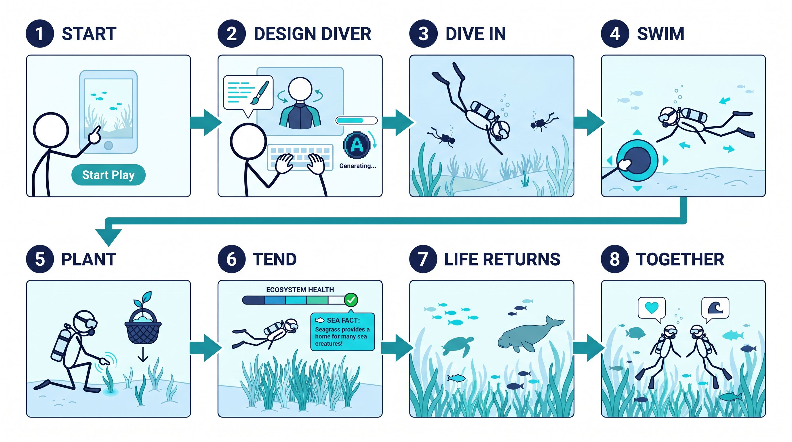
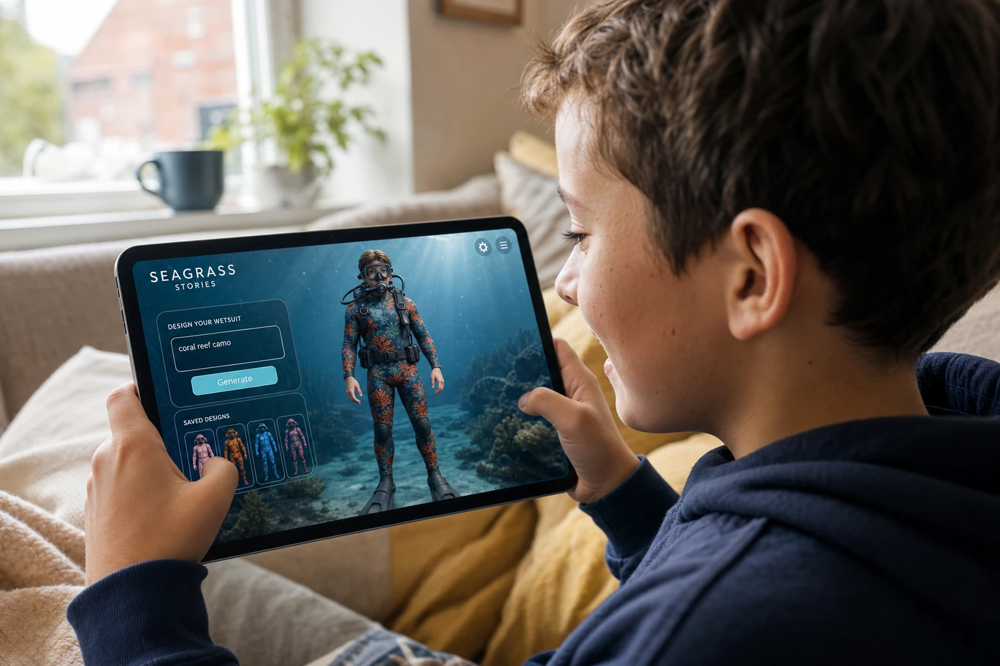
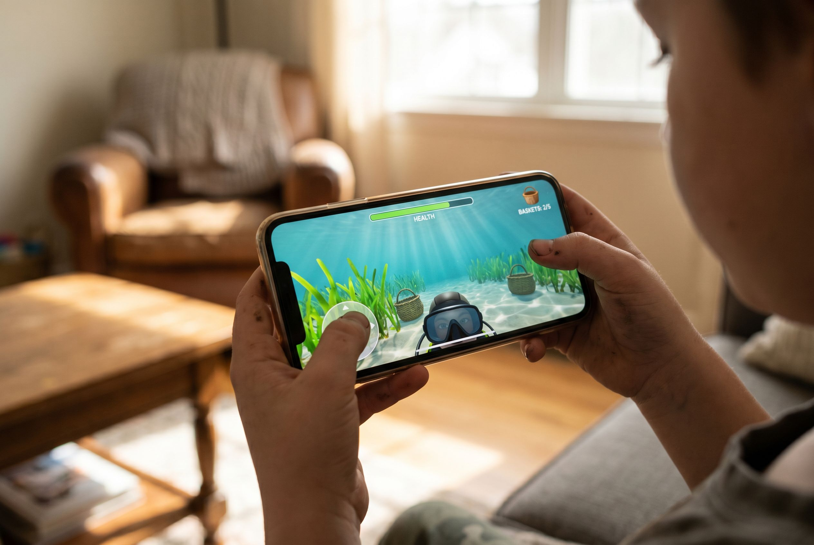
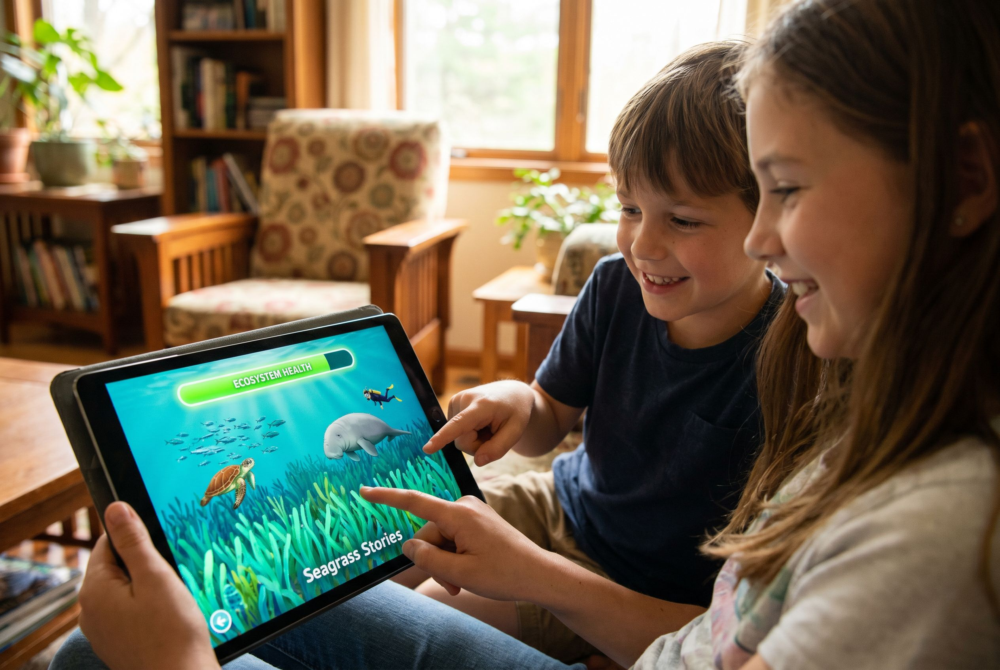
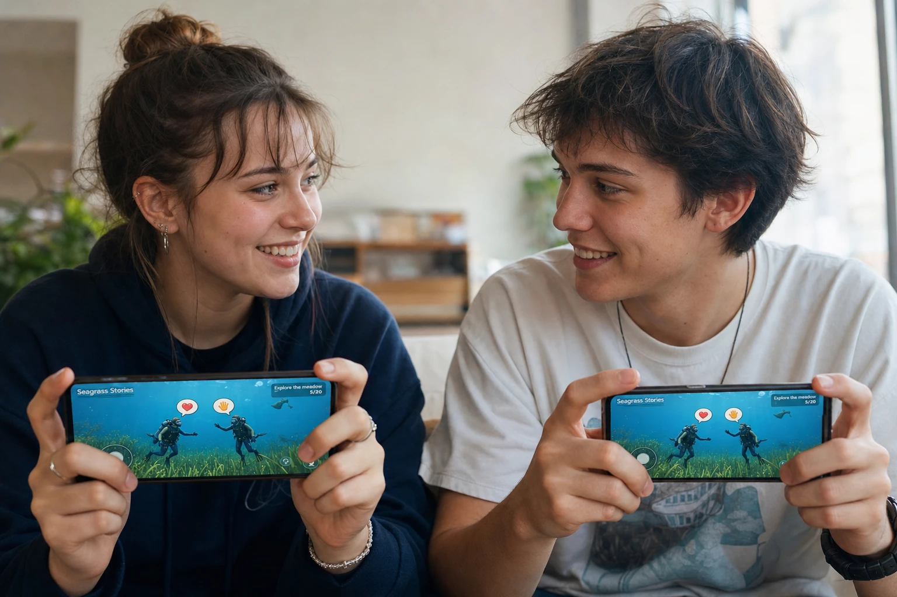

# Seagrass Stories

**Seagrass Stories** is a calm, hopeful underwater game you play in your browser or on a tablet. You're a **scuba diver** helping bring a damaged seafloor back to life. Plant seagrass, watch your meadow grow, and slowly the fish, turtles, and other sea creatures come back.

It's a **shared world**: everyone who's online is diving in the same ocean at the same time, helping each other tend the meadow. The world keeps living even when you're away — leave, come back later, and see how it's changed. There's no chat; players simply send **emoji** to say hello, thank you, or cheer each other on.

**In short:** dive in → make your diver your own → plant and care for an underwater garden → bring marine life back, together.

- **Who it's for:** kids and young adults — gentle, friendly, no reading required
- **Where you play:** any web browser, on tablet or computer (tap or click)
- **The feeling:** peaceful, rewarding, and quietly meaningful — caring for nature, together



> Concept storyboard of the end-to-end player journey. (Concept visuals are AI-generated for design/pitch.)

---

## How it plays (the quick version)

1. 🌊 **Start** — tap "Start Play" on a calm underwater title screen.
2. 🤿 **Make it yours** — name your diver and design their wetsuit (an AI turns your idea into the artwork).
3. ⬇️ **Dive in** — drop into the shared meadow and see other divers already there.
4. 👆 **Swim** — tap the seafloor to glide around.
5. 🧺 **Plant** — place an anchor basket, then plant seagrass in it.
6. 🌱 **Tend** — your seagrass grows, but the ocean is always wearing it down, so keep planting to stay ahead.
7. 🐠 **Life returns** — as the meadow gets healthier, fish, turtles, and other animals come back.
8. 🤝 **Together** — more divers means more hands helping; say hello with emoji.
9. 🔁 **Come back anytime** — the world keeps living while you're gone, so it's always changed when you return.

For the full beat-by-beat version, see the detailed journey below.

---

## User Journey (storyboard steps)

Each numbered step is a beat in the player's experience, written to map directly onto a storyboard panel. Player actions are in **bold**; what the player sees/feels is in plain text.

### 1. Arrive — Splash screen
The player lands on a calm underwater title screen: "Seagrass Stories", soft light shafts, a single **Start Play** button. One clear call to action, no menus.

### 2. Personalise — Name your diver
The player **enters a username**. A 3D scuba diver slowly rotates in preview.

### 3. Personalise — Design the wetsuit with AI
The player **types a prompt** (e.g. "coral reef camo", "deep-sea bioluminescence") and **taps Generate**. An AI image becomes the diver's wetsuit **texture**, applied live on the rotating preview. The player can **regenerate** for a new look or **pick a saved texture** from their history. **Tap Confirm** to lock the look.

### 4. Descend — Enter the shared meadow
The diver drops into the underwater seagrass meadow. The player sees the current **state of the world** — some healthy patches, some bare seabed — and **other divers** already swimming nearby. A short message: "whoever's online is here with you."

### 5. Learn to move
A prompt invites the player to **tap/click the seafloor**. The diver glides to that spot; the camera follows. The player gets a feel for swimming around the meadow.

### 6. Place an anchor basket
Tutorial prompt: "Tap the seafloor to place an anchor basket." The player **taps an open patch of seabed**, a ghost preview appears, and **confirms**. A woven, natural-material **anchor basket** settles on the sand — the foundation seagrass needs to take root.

### 7. Plant seagrass
Prompt: "Tap your basket to plant seagrass." The player **taps the deployed anchor**, and young seagrass blades sprout from it.

### 8. Watch it grow
The seagrass **slowly grows** over time, swaying in the current. The player sees their patch maturing — a small, satisfying sign of progress.

### 9. Feel the pressure — keep the habitat alive
An **ecosystem-health meter** shows the meadow's condition. The environment **constantly decays**: if seagrass isn't planted faster than it dies back, the water turns murkier and the seabed pales. The player must **keep placing baskets and planting** to stay ahead of the decline.

### 10. Recovery — life returns
As enough healthy seagrass accumulates and health rises past thresholds, **marine animals return**: fish schools, a sea turtle, a seahorse, a crab. The meadow visibly comes alive — the reward for tending it.

### 11. Better together
**More divers online = more hands planting**, so the habitat is easier to sustain as a group. (No magic bonus — the help is simply other real players doing the work alongside you.)

### 12. Talk in emoji
Players **send emoji** to each other (a heart, a wave, a thumbs-up) that float above their divers. It's the only way to communicate — friendly, language-free, and safe for all ages.

### 13. Leave and return — a living world
When the player leaves, the **world keeps simulating**. Seagrass keeps growing, decay keeps pressing, animals come and go based on the meadow's health. The player can **return any time** to see how the shared meadow has changed since they were last there.

---

## Suggested storyboard shot list (8 panels)

A condensed version for a single wide storyboard strip (use the `oceanx-storyboards` skill, scuba-diver actor, line-art style):

1. **Start** — splash screen, diver taps "Start Play"
2. **Personalise** — diver + username + AI wetsuit prompt → generated texture
3. **Descend** — diver enters the meadow, other divers nearby
4. **Place** — tap seafloor → anchor basket settles on the sand
5. **Plant** — tap basket → seagrass sprouts
6. **Tend** — seagrass grows; ecosystem-health meter; decay pressure
7. **Recover** — healthy meadow, fish/turtle/seahorse return
8. **Together & away** — divers exchange emoji; world keeps living when they leave

---

## Scene shots — the experience in use

Concept photography of real players using Seagrass Stories on phone, tablet, and browser. (The scuba diver is the on-screen game **avatar** — the players themselves are not diving.)

| Personalise the diver | Place & plant |
| --- | --- |
|  |  |
| **Life returns** | **Playing together** |
|  |  |

---

## Tech Stack

| Layer | Technology | Notes |
| --- | --- | --- |
| **Framework** | [Next.js 16](https://nextjs.org/) (App Router) + [React 19](https://react.dev/) | TypeScript, built with Turbopack |
| **Language** | [TypeScript 5](https://www.typescriptlang.org/) | strict typing across app/components/lib |
| **3D engine** | [Three.js](https://threejs.org/) `r184` | WebGL rendering |
| **3D / React** | [React Three Fiber 9](https://r3f.docs.pmnd.rs/) + [drei 10](https://drei.docs.pmnd.rs/) | declarative scene, `useFBX`/`useTexture` loaders |
| **Post-processing** | [@react-three/postprocessing 3](https://github.com/pmndrs/react-postprocessing) | bloom / color grade / DOF (P5) |
| **State** | [Zustand 5](https://zustand.docs.pmnd.rs/) | local game + UI state |
| **Styling** | [Tailwind CSS 4](https://tailwindcss.com/) | via PostCSS |
| **Backend & data** | [Supabase](https://supabase.com/) (Postgres + Realtime) | persistence (P2) & multiplayer presence/broadcast (P3) |
| **AI textures** | [Replicate](https://replicate.com/) | AI-generated diver wetsuit textures (P4) |
| **Hosting** | [Vercel](https://vercel.com/) | serverless API routes + static assets, auto-deploy from `main` |
| **Tooling** | ESLint 9 (`eslint-config-next`) | linting |

## AI wetsuit texture pipeline

When a player designs their wetsuit, a short idea is turned into a finished, durable texture on the diver's suit. The diver's `M_Suit` material is one continuous **full-body UV unwrap** (torso, arms, legs), so the whole pipeline is tuned to produce a **seamless, tileable, evenly-distributed material** — no focal point, no body shapes.

```
Player idea ("coral camo")
      │
      ▼
1. Prompt enhancement   ─ google/gemini-2.5-flash (Replicate)
   Expands the idea into a detailed, UV-aware prompt for a seamless
   full-body wetsuit material. 20s timeout + template fallback.
      │
      ▼
2. Image generation     ─ google/nano-banana-2 (Replicate)
   Renders a 1K, 1:1 seamless neoprene texture from that prompt.
      │
      ▼
3. Persist (server)     ─ Supabase Storage + Postgres
   The API route downloads the image bytes (Replicate URLs expire),
   uploads them to the public `diver-textures` bucket, and records a
   `diver_textures` row owned by the player (anonymous auth + RLS).
      │
      ▼
4. Apply + save         ─ client
   The durable public URL is applied to the M_Suit material live, and
   added to the player's saved-designs history (survives reload).
```

- **Where it lives:** the server route [`app/api/generate-texture/route.ts`](app/api/generate-texture/route.ts) (the Replicate token stays server-side); client helpers in [`lib/player.ts`](lib/player.ts); schema in [`supabase/migrations/`](supabase/migrations/).
- **Graceful degradation:** every step is best-effort — if the enhancer is slow it falls back to a simple template; if Supabase isn't configured the texture still generates and the history stays in-memory for the session.
- **Models are swappable** via `REPLICATE_MODEL` (image) — the enhancer model is set in the route.

> Supabase and Replicate are now wired up (P4). Texture generation and saved history need the Replicate + Supabase keys below; without them the game still renders, but the AI wetsuit feature is disabled.

## Deploy (Vercel)

Next.js is auto-detected. Import the repo at [vercel.com/new](https://vercel.com/new) and deploy; every push to `main` then auto-deploys. To enable the AI wetsuit textures + saved history, set these environment variables (Production + Preview) — see [.env.local.example](.env.local.example):

| Variable | Used by | Notes |
| --- | --- | --- |
| `REPLICATE_API_TOKEN` | server | prompt enhancement + image generation |
| `REPLICATE_MODEL` | server | optional; defaults to `google/nano-banana-2` |
| `NEXT_PUBLIC_SUPABASE_URL` | client + server | Supabase project URL |
| `NEXT_PUBLIC_SUPABASE_ANON_KEY` | client | anon key (RLS-scoped) |
| `SUPABASE_SERVICE_ROLE_KEY` | server only | uploads + writes; **never** exposed to the browser |

One-time Supabase setup: run the SQL in [`supabase/migrations/`](supabase/migrations/) and enable **Anonymous** sign-in (Authentication → Providers).

## Status & how to run

Early build. Phase 0 (scaffold + swimmable diver) is in place, now rendering the real textured diver model (`public/models/diver/`).

```bash
npm install
npm run dev        # → http://localhost:3000
```

See [the build plan](~/.claude/plans/) for the phased roadmap (P0 scaffold → P1 core loop → P2 persistence → P3 multiplayer → P4 AI texture → P5 PBR/animals → P6 polish). Remaining models (seagrass, anchor basket, animals) are placeholders until their GLB assets are added to `public/models/`.
